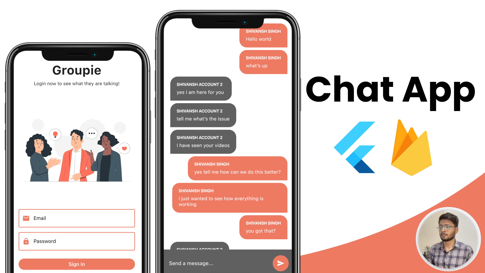

# group_chatapp_flutter_firebase
Group based chat app in Flutter and Firebase with Cloudfirestore, Firebase Auth and StreamBuilders 🔥

# Overview
Welcome to the master class of flutter and firebase in which we will create a chat app from scratch. Today you're going to learn the best practices when it comes to enabling firebase for your flutter project.

## [Watch it on YouTube](https://youtu.be/Qwk5oIAkgnY)
 
 ## SETTING IT UP
 1. Add firbease to this project and do check the google-services.json and GoogleServices-Info.plist file
 2. Now run the app 
 
 

Happy Learning 👍

 
 
Subscribe Now! <a href="https://www.youtube.com/channel/UCknAgO0AdG61Yd1G7D1Arxg">BackSlash Flutter YouTube Channel</a>
Show some :heart: and star the repo to support the project

   

<h3>Stay Healthy!✨Stay Safe!🖖</h3>
 

## Note
 I do not own any of the images used in this project.

For help getting started with Flutter, view our
[online documentation](https://flutter.dev/docs), which offers tutorials,
samples, guidance on mobile development, and a full API reference.

